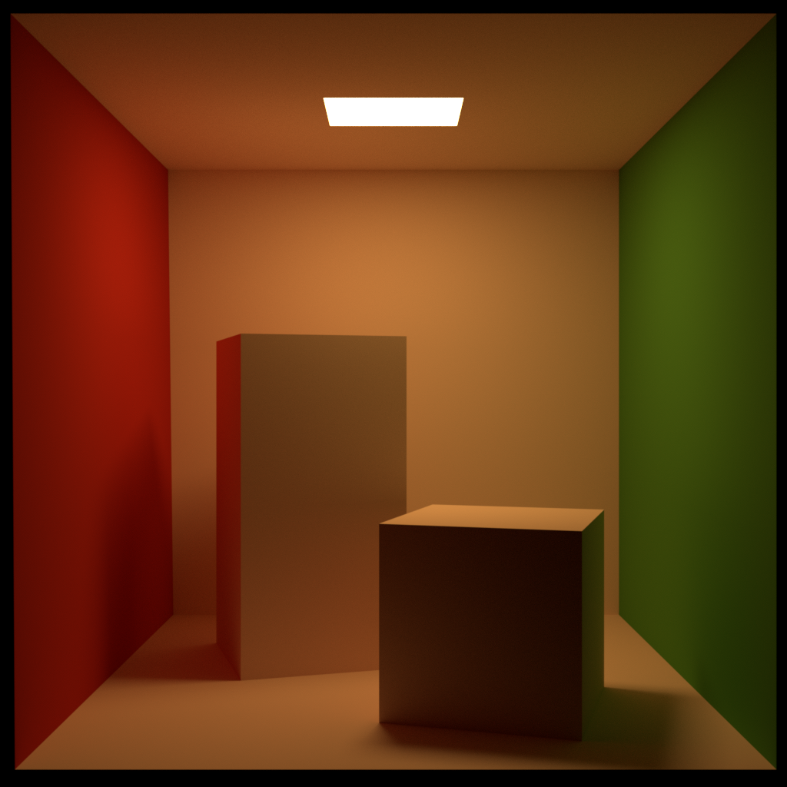
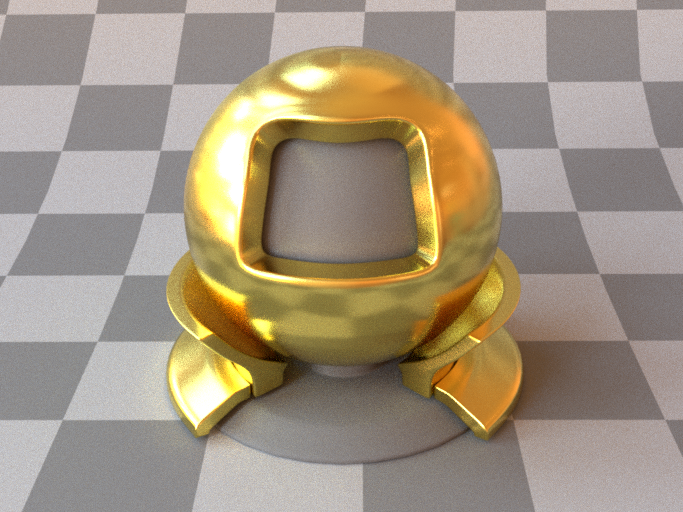
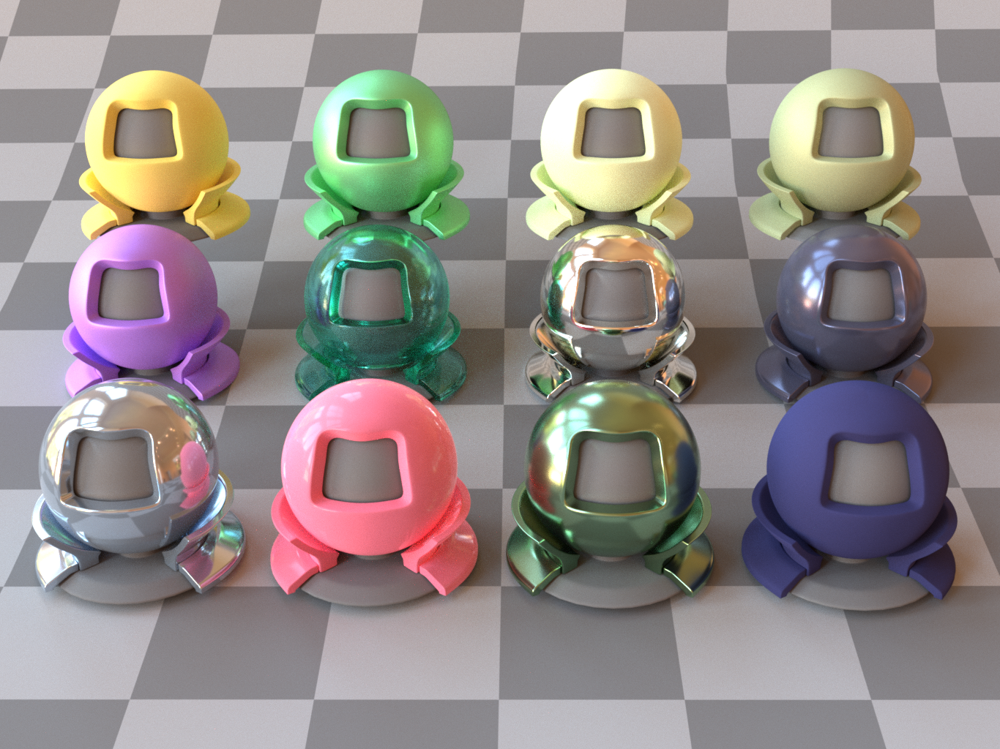
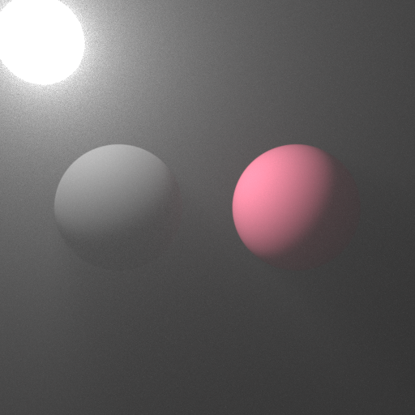
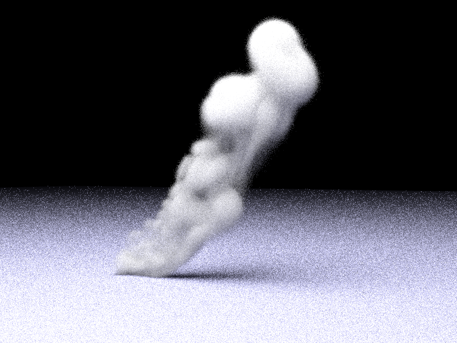

# labrender
cpu renderer

# feature
- implement multiple importance rendering

- support disney pricinpled bsdf

- implement vol path rendering
# show
| |
| :----------------------------------------: |
|    |


| |
| :----------------------------------------------------------: |
|                    
| |
| :----------------------------------------------------------: |
|                        

| |
| :----------------------------------------------------------: |
|                     

| |
| :----------------------------------------------------------: |
|                    
| |
| :----------------------------------------------------------: |
|                                     |


# Build
All the dependencies are included. Use CMake to build.
If you are on Unix systems, try
```
mkdir build
cd build
cmake ..
cmake --build .
```
It requires compilers that support C++17 (gcc version >= 8, clang version >= 7, Apple Clang version >= 11.0, MSVC version >= 19.14).

Apple M1 users: you might need to build Embree from scratch since the prebuilt MacOS binary provided is built for x86 machines. (But try build command above first.)

# Run
Try 
```
cd build
./lajolla ../scenes/cbox/cbox.xml
```
This will generate an image "image.exr".

To view the image, use [hdrview](https://github.com/wkjarosz/hdrview), or [tev](https://github.com/Tom94/tev).

